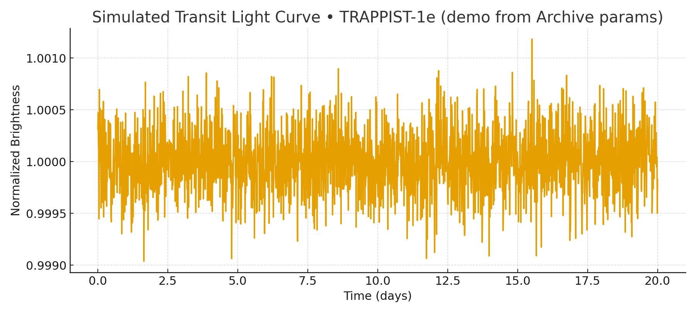

# Exoplanet Transit Light Curves

This repository contains a Python tool to simulate **exoplanet transit light curves** using a professional trapezoid model.  
It is designed for **students, amateur astronomers, and educators** to explore how orbital geometry affects the shape and depth of transit light curves.

## Features
- Input key orbital parameters: P, t0, Rp/Rs, a/Rs, b
- Input observing parameters: total span, cadence, noise level
- Generates trapezoid light curve with ingress/egress durations
- Educational outputs: T14, T23, depth, inclination

## Requirements
See `requirements.txt` for dependencies.

## Usage
```bash
python transit_from_archive_checkdeps.py
```
Follow the prompts to enter parameters. The program will display the simulated transit light curve.

## Example Parameters
- P = 3.0 days
- t0 = 1.5 days
- Rp/Rs = 0.02
- a/Rs = 15.0
- b = 0.2
- Total span = 20 days
- Cadence = 10 min
- Noise = 300 ppm
<p align="center">
  
</p>

## License
This project is licensed under the MIT License.
